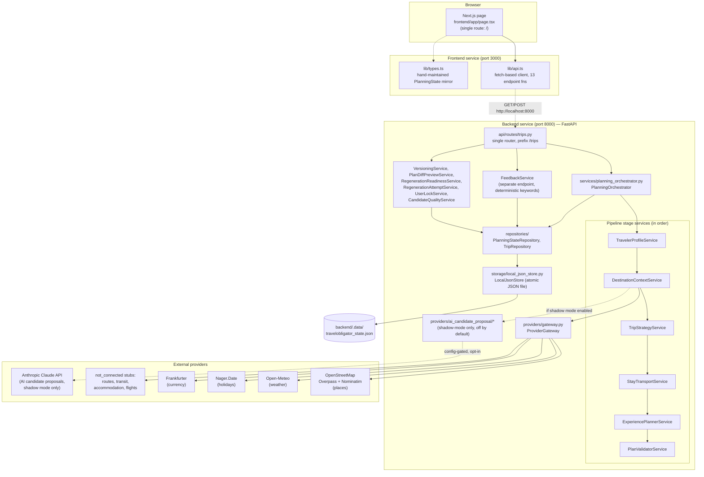
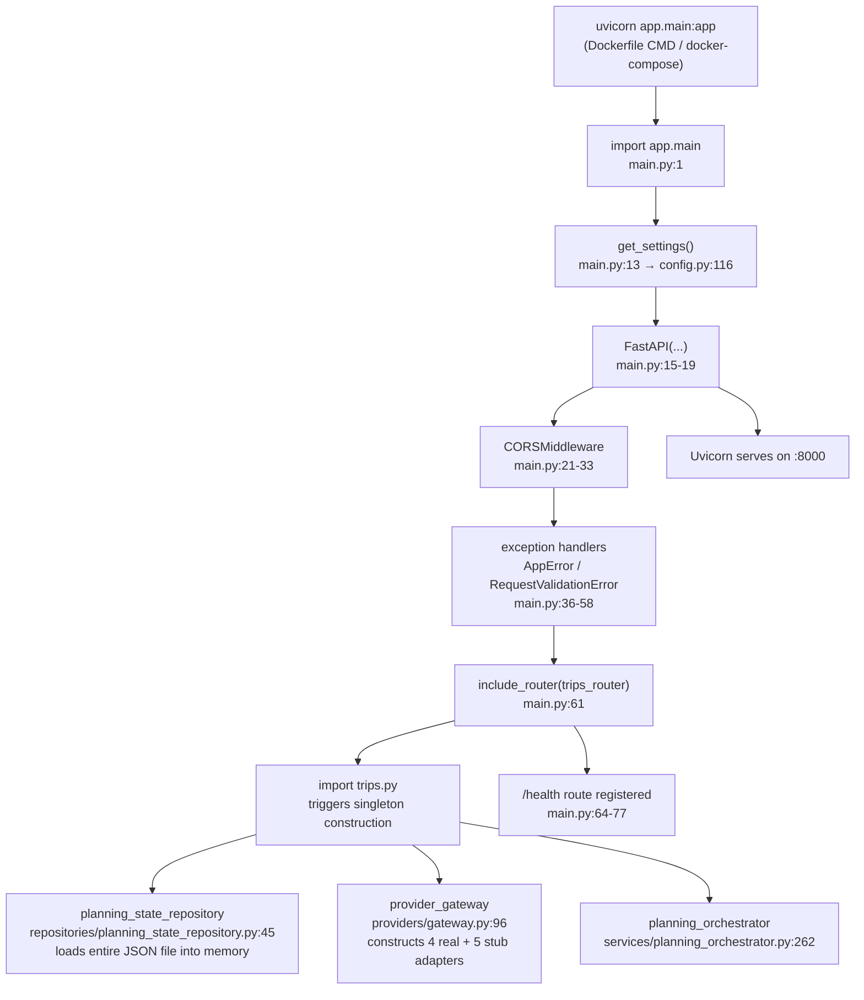
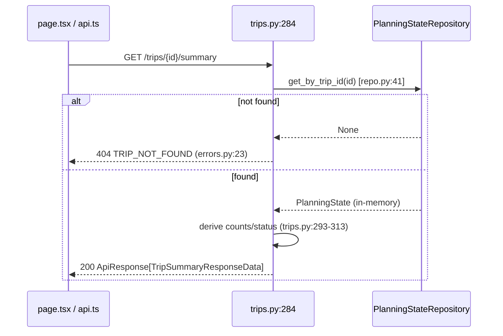
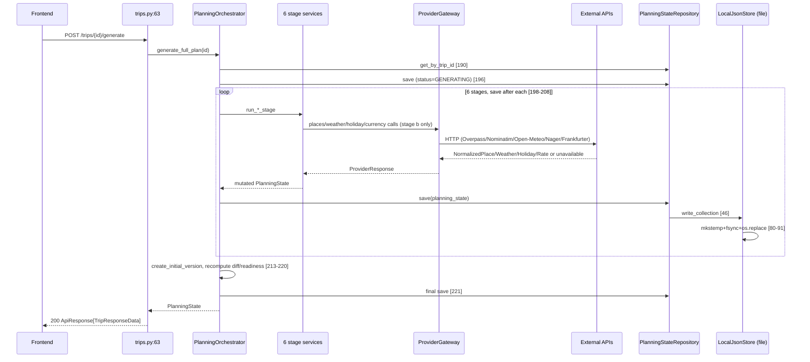
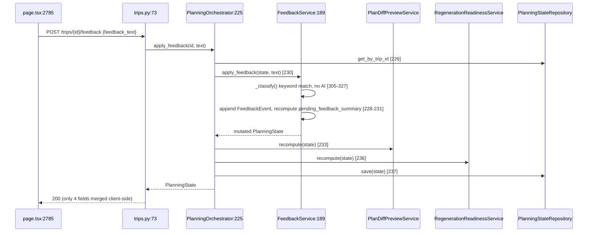
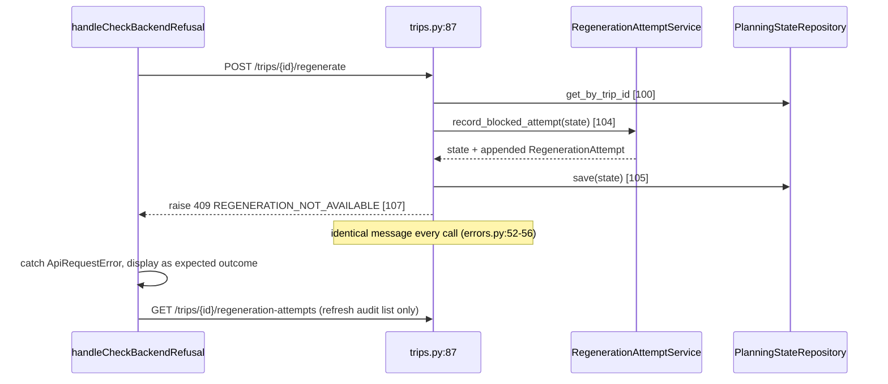
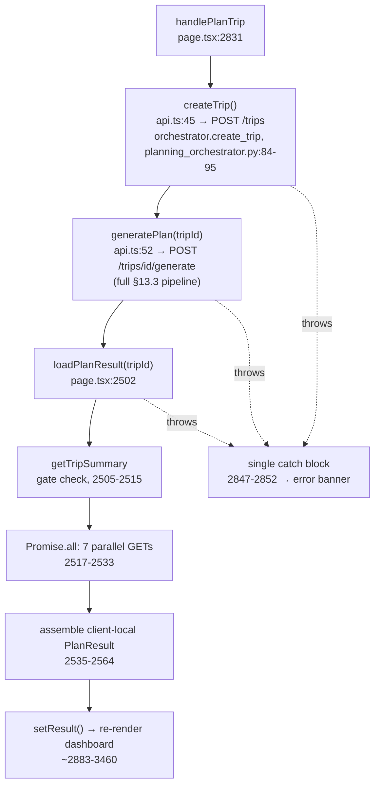
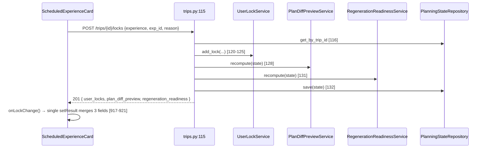

# TravelObligator — Codebase Overview

*Read-only technical survey. Every non-obvious claim below is grounded in a file actually opened during this survey; paths are given inline. Sections/claims that could not be fully verified are marked explicitly rather than guessed.*

## Table of Contents

1. [Overview & Purpose](#1-overview--purpose)
2. [Repo Map](#2-repo-map)
3. [Languages, Frameworks & Tooling](#3-languages-frameworks--tooling)
4. [Dev vs Prod Startup](#4-dev-vs-prod-startup)
5. [Architecture Diagram](#5-architecture-diagram)
6. [Backend Deep Dive](#6-backend-deep-dive)
   - 6.1 [API Surface](#61-api-surface)
   - 6.2 [Orchestrator & Pipeline Services](#62-orchestrator--pipeline-services)
   - 6.3 [Provider Architecture](#63-provider-architecture)
   - 6.4 [AI Candidate Proposal / Shadow-Mode Subsystem](#64-ai-candidate-proposal--shadow-mode-subsystem)
   - 6.5 [Data Models](#65-data-models)
   - 6.6 [Storage & Repositories](#66-storage--repositories)
   - 6.7 [Test Suite](#67-test-suite)
   - 6.8 [Auth](#68-auth)
7. [Frontend Deep Dive](#7-frontend-deep-dive)
   - 7.1 [Structure & Single-Page Layout](#71-structure--single-page-layout)
   - 7.2 [Data Fetching Layer](#72-data-fetching-layer)
   - 7.3 [State Management](#73-state-management)
   - 7.4 [Types](#74-types)
   - 7.5 [Styling](#75-styling)
   - 7.6 [Key Interaction Flows](#76-key-interaction-flows)
8. [Docs Directory Summary](#8-docs-directory-summary)
9. [Data Model Relationships](#9-data-model-relationships)
10. [.github: CI & AI-Assistant Instructions](#10-github-ci--ai-assistant-instructions)
11. [Notable Gaps, Divergences & Unverified Items](#11-notable-gaps-divergences--unverified-items)
12. [Appendix: Key File Index](#12-appendix-key-file-index)
13. [Traced Code Flows](#13-traced-code-flows)
    - 13.1 [App Startup / Bootstrap](#131-app-startup--bootstrap)
    - 13.2 [Read Path — `GET /trips/{trip_id}/summary`](#132-read-path--get-tripstrip_idsummary)
    - 13.3 [Write Path — `POST /trips/{trip_id}/generate`](#133-write-path--post-tripstrip_idgenerate)
    - 13.4 [Provider Call — DestinationContextService → ProviderGateway → OpenStreetMap](#134-provider-call--destinationcontextservice--providergateway--openstreetmap)
    - 13.5 [Write Path — `POST /trips/{trip_id}/feedback`](#135-write-path--post-tripstrip_idfeedback)
    - 13.6 [Gate/Refusal Flow — `POST /trips/{trip_id}/regenerate`](#136-gaterefusal-flow--post-tripstrip_idregenerate)
    - 13.7 [Frontend End-to-End Trip Creation](#137-frontend-end-to-end-trip-creation)
    - 13.8 [Lock ("Keep This Place") Flow](#138-lock-keep-this-place-flow)
14. [Cross-Cutting Concerns](#14-cross-cutting-concerns)
15. [Phase 5 Observations](#15-phase-5-observations)

---

## 1. Overview & Purpose

TravelObligator is an AI travel **decision** platform, not a one-shot itinerary generator (per `README.md`, `docs/00_product_vision.md`). Its central design commitment, stated consistently across every architecture doc and enforced in code, is:

> Providers supply facts. AI supplies reasoning and explanation. AI must not invent factual travel data. (`Claude.md`)

The whole system is built around a single object, `PlanningState`, that flows through a staged backend pipeline and is the frontend's sole source of truth for rendering. The project is a two-service app: a Python/FastAPI backend (`backend/`) and a Next.js/React frontend (`frontend/`), backed today by a local JSON file rather than a database.

This document was produced by a read-only survey of the repository: an initial repo-wide structure pass, followed by targeted deep-dive passes over `backend/`, `frontend/`, the full `docs/` directory, root-level specs, and `.github/`. No files were modified to produce it.

## 2. Repo Map

| Path | Purpose |
|---|---|
| `backend/` | FastAPI/Python backend — API, orchestrator, pipeline services, provider adapters, models, local JSON persistence. |
| `frontend/` | Next.js 16 / React 19 / TypeScript frontend — a single dashboard page rendering `PlanningState`. |
| `docs/` | Numbered architecture/design spec (`00`–`18`, `20`, `99`) — the canonical, actively-maintained reference set. |
| `shared/` | Placeholder only. Contains a single `shared/README.md` (136 bytes) stating intent to hold shared TS types/contracts; no code exists here yet. |
| `.github/` | CI workflow (`workflows/ci.yml`) plus AI-coding-assistant instructions/prompts for GitHub Copilot (`copilot-instructions.md`, `instructions/*.md`, `prompts/*.prompt.md`). |
| `.claude/` | Claude Code local settings (`settings.local.json`) and a nested git worktree (`.claude/worktrees/jolly-soaring-eagle/`) — a full duplicate checkout, not source; excluded from this survey. |
| `README.md` | Product-facing overview, MVP scope, data policy summary, doc reading order, current-status notes. |
| `Claude.md` | Root instructions for AI coding assistants (Claude Code specifically) working in this repo. |
| `ARCHITECTURE.md` | Architecture V1 reference — planning flow, provider architecture, backend/frontend structure, DB strategy, and an explicit note on interim local persistence. |
| `PLANNING_ENGINE.md` | Condensed deep dive on the staged `PlanningState` pipeline; largely restates `ARCHITECTURE.md`/`docs/09`/`docs/13`. |
| `itinerary-generator-build-spec.md` | The more aspirational, original 13-stage build spec that later numbered docs (13, 14, 18) trace their "Step" numbering back to. |
| `TASKS.md` | Phased implementation checklist; largely unchecked and stale relative to actual implementation depth (see §11). |
| `docker-compose.yml` | Local dev orchestration: `backend`, `frontend`, `postgres:16`, `redis:7`. |
| `pytest.ini` | Root pytest config: `pythonpath = backend`, `testpaths = backend/app/tests`. |
| `LICENSE`, `.gitignore` | Standard. |

**Excluded from this survey** (per task instructions and standard practice): `node_modules`, `.next`, `.venv`/`__pycache__`/`.pytest_cache`, lockfiles, `.claude/worktrees/*`, `.git`.

## 3. Languages, Frameworks & Tooling

**Backend** — Python, per `backend/requirements.txt`:
- `fastapi==0.136.1`, `starlette==1.0.0`, `uvicorn==0.46.0`
- `pydantic==2.13.3`, `pydantic-settings==2.7.1`
- `httpx==0.28.1` (provider HTTP calls)
- `psycopg[binary]==3.2.3`, `redis==5.2.1` — declared but **not actually used anywhere in `app/`** (see §11)
- `anthropic` (unpinned; used by the Anthropic candidate-proposal adapter)
- Dev-only: `backend/requirements-dev.txt` adds `pytest==9.1.1`

No `pyproject.toml`, `Pipfile`, `go.mod`, or `Cargo.toml` exists anywhere in the repo.

**Frontend** — `frontend/package.json`:
- `next: 16.2.4`, `react: 19.2.4`, `react-dom: 19.2.4`
- `leaflet: ^1.9.4` (+ `@types/leaflet`) — the only non-framework runtime dependency, used for per-day maps
- Dev: `typescript ^5`, `eslint ^9` + `eslint-config-next`, `tailwindcss ^4` + `@tailwindcss/postcss`
- Scripts: `dev` → `next dev`, `build` → `next build`, `start` → `next start`, `lint` → `eslint`
- **No test framework** — no jest/vitest/playwright/testing-library in `package.json`, and no `*.test.*`/`*.spec.*` files exist under `frontend/`.

`frontend/AGENTS.md` (included into `frontend/CLAUDE.md` via `@AGENTS.md`) flags this as a non-standard/bleeding-edge Next.js version and directs readers to `node_modules/next/dist/docs/` before writing code.

**Local orchestration** — `docker-compose.yml` (root): `postgres:16` (5432), `redis:7` (6379), `backend` (built from `backend/Dockerfile`, port 8000), `frontend` (built from `frontend/Dockerfile`, port 3000). All services load a root `.env` — **no `.env.example` exists anywhere in the repo** despite `Claude.md` instructing its use; the full expected variable list has to be reconstructed from `backend/app/core/config.py`.

**CI** — `.github/workflows/ci.yml`, two independent jobs on `ubuntu-latest`:
- `backend`: Python **3.13**, `pip install -r requirements.txt` (+ `requirements-dev.txt`), `python -m compileall app`, then `pytest` from repo root.
- `frontend`: Node 20, `npm ci`, `npm run lint`.

No frontend build/test step, no backend lint/type-check step (no ruff/mypy), and no deploy step exist in CI.

## 4. Dev vs Prod Startup

**Dev (Docker Compose)**: `docker compose up` starts all four services. `backend` runs `uvicorn app.main:app --host 0.0.0.0 --port 8000 --reload` with a live-reload volume mount; `frontend` runs `npm run dev`.

**Dev (manual, inferred — not written anywhere as explicit instructions)**: `uvicorn app.main:app --reload` from `backend/`, `npm run dev` from `frontend/`. No README/Makefile/Procfile states this directly; it is inferred from Dockerfile/compose contents.

**Prod**: `backend/Dockerfile`'s CMD drops `--reload`, which looks like the intended prod entrypoint. However, `frontend/Dockerfile`'s CMD is `npm run dev` **unconditionally** — the frontend Docker image as committed never runs `next build && next start`, which reads as a gap rather than an intentional production path. There is no separate prod compose file, Procfile, or deployment workflow anywhere in the repo.

**Local persistence** (a load-bearing fact for understanding "prod" at all right now): despite `DATABASE_URL`/`psycopg`/the compose `postgres` service being present, the backend currently persists all data to a local JSON file, `backend/.data/travelobligator_state.json` (gitignored), via `backend/app/storage/local_json_store.py`. `ARCHITECTURE.md` §12a explicitly labels this "interim, pre-database" and "not production persistence." See §11.

## 5. Architecture Diagram



## 6. Backend Deep Dive

### 6.1 API Surface

All HTTP routes live in a single router file, `backend/app/api/routes/trips.py`, mounted under `/trips` (`backend/app/main.py`):

| Method & Path | Behavior |
|---|---|
| `POST /trips` | `planning_orchestrator.create_trip()` |
| `GET /trips/{trip_id}` | `planning_state_repository.get_by_trip_id()` |
| `POST /trips/{trip_id}/generate` | `planning_orchestrator.generate_full_plan()` — runs the full 6-stage pipeline |
| `POST /trips/{trip_id}/feedback` | `planning_orchestrator.apply_feedback()` → `FeedbackService` |
| `POST /trips/{trip_id}/regenerate` | **Hard refusal.** Calls `regeneration_attempt_service.record_blocked_attempt()`, saves state, then always raises `regeneration_not_available_error()` (HTTP 409, `REGENERATION_NOT_AVAILABLE`). Never runs `/generate` or any stage. |
| `POST /trips/{trip_id}/locks` | `user_lock_service.add_lock()` → recompute `plan_diff_preview` + `regeneration_readiness` → save |
| `DELETE /trips/{trip_id}/locks/{lock_id}` | `user_lock_service.remove_lock()` → same recompute chain |
| `GET /trips/{trip_id}/destination-context` | Reads `planning_state.destination_context` (409 if not generated) |
| `GET /trips/{trip_id}/candidate-quality` | Reads `planning_state.candidate_quality_report`, read-only |
| `GET /trips/{trip_id}/experience-plan` | Reads `planning_state.experience_plan` (409 if not generated) |
| `GET /trips/{trip_id}/validation-report` | Reads `planning_state.validation_report` (409 if not generated) |
| `GET /trips/{trip_id}/summary` | Assembles derived counts/statuses from `planning_state` |
| `GET /trips/{trip_id}/provider-coverage` | Reads `provider_coverage`/`provider_status`/`unavailable_data`/`data_sources_used` |
| `GET /trips/{trip_id}/regeneration-readiness` | Read-only; always reports `blocked`/`can_regenerate: false` today |
| `GET /trips/{trip_id}/regeneration-attempts` | Read-only, append-only audit trail of blocked `/regenerate` calls |

Every response is wrapped in a standard envelope (`backend/app/schemas/api_responses.py`, `backend/app/core/response.py`):
```json
{ "success": bool, "data": {...}|null, "message": str|null, "errors": [{"code","field","message"}], "metadata": {"request_id","timestamp","environment"} }
```
Error codes are a fixed 12-value enum in `backend/app/schemas/errors.py`: `VALIDATION_ERROR, TRIP_NOT_FOUND, PLANNING_STATE_NOT_FOUND, LOCK_NOT_FOUND, REGENERATION_NOT_AVAILABLE, PROVIDER_FAILED, PROVIDER_NOT_CONNECTED, DATA_UNAVAILABLE, AI_OUTPUT_INVALID, STAGE_ALREADY_RUNNING, STAGE_FAILED, UNSUPPORTED_OPERATION, INTERNAL_ERROR`. Response schemas under `backend/app/schemas/` are thin, read-only wrappers around the domain models in `backend/app/models/` — they add essentially no new fields.

### 6.2 Orchestrator & Pipeline Services

`PlanningOrchestrator` (`backend/app/services/planning_orchestrator.py`) loads/saves `PlanningState` and runs stage services in a fixed order inside `generate_full_plan`:

1. **`TravelerProfileService`** — builds `traveler_profile` from `trip_request` fields only, no provider calls.
2. **`DestinationContextService`** — the main data-gathering stage. Calls `ProviderGateway` for places/weather/holiday/currency; populates `destination_context`, `weather_context`, `holiday_context`, `currency_context`, `provider_coverage`. Immediately followed by `CandidateQualityService.build_report()` and, only if config-gated shadow mode is on, the AI candidate discovery dry run (§6.4).
3. **`TripStrategyService`** — deterministic duration calculation only; suitability/budget scoring fields stay unset (no provider backs them yet).
4. **`StayTransportService`** — stay-area/transport strategy; the stay-area recommendation itself stays unset (no accommodation provider connected).
5. **`ExperiencePlannerService`** (`backend/app/services/experience_planner_service.py`, 1,626 lines — the largest service) — schedules candidate POIs into `DailyPlan`s:
   - Pace caps: `RELAXED→2, BALANCED→3, PACKED→4` attractions/day.
   - Only candidates in `CandidateQualityService` tiers `PRIMARY_ANCHOR`/`GOOD_CANDIDATE`/`SECONDARY_CANDIDATE` are eligible; `LOW_PRIORITY` and `REJECTED` are excluded entirely, even as filler ("trust over fullness" — a day is left lighter rather than padded).
   - Ordering: must-visit matches → interest matches → everything else (provider order preserved within tier); day grouping picks a highest-priority "anchor" per day, then fills remaining slots by nearest-haversine-distance to the anchor.
   - Within a day, a nearest-neighbor walk orders stops — explicitly **not** real route optimization.
   - Also builds restaurant/accommodation proximity suggestions (capped at 2/day each), plan-level `stay_area_guidance` (top 3 accommodation POIs by average distance to all scheduled experiences), `decision_summary`, `implementation_gaps`, `readiness_checklist`, and `route_feasibility_context` — all deterministic restatements of already-known data.
   - `experience_plan.confidence` is a fixed constant (`0.35` if any candidates exist, else `0.0`), not computed per-candidate.
6. **`PlanValidatorService`** (`backend/app/services/plan_validator_service.py`, 508 lines) — deterministic checks. **`readiness_status` can currently only be `BLOCKED` or `NEEDS_REVIEW`** — there is no code path producing `READY` (route/timing/opening-hours checks are "not implemented yet," per an always-added `feasibility` warning). Blocked only when no scheduled experiences exist. Other non-blocking warnings: geographic spread >8km/day, captured constraints, unmatched must-visit terms (checked against scheduled experience names, not just the candidate pool — Step 156G), budget (never claims cost was validated), weather (precip >50%, temp >30°C or <5°C), and holidays in range.

Called from a separate endpoint (not part of `generate_full_plan`):
- **`FeedbackService`** (`backend/app/services/feedback_service.py`, 330 lines) — pure deterministic lowercase-substring keyword classifier (categories: `pace_change`, `interest_change`, `remove_or_avoid`, `restaurant_preference`, `stay_preference`, `transport_preference`, else `general_feedback`), with a fixed priority order for picking one primary type when multiple match. Every event is tagged `regeneration_strategy=EXPLANATION_ONLY`; **no plan section is ever regenerated by this service.**

Additional services layered on top of the core 6-stage pipeline (present in code, beyond what `docs/14_backend_architecture.md`'s original stage list names): `VersioningService`, `PlanDiffPreviewService`, `RegenerationReadinessService`, `RegenerationAttemptService`, `UserLockService`, `ProviderCoverageService`, `CandidateQualityService`, `CandidateGroundingService`, plus AI-contract-builder helpers (`AIReasoningContractBuilder`, `AICandidateProposalRequestBuilder`, `CandidateGroundingRequestBuilder`). Code comments reference these by incremental "Step" numbers (132, 135, 142, 156A–G, 160A–E, 161A–C) that correspond to the build log in `docs/13_llm_reasoning_pipeline.md` §26–40 and `docs/18_candidate_quality.md`.

### 6.3 Provider Architecture

`ProviderGateway` (`backend/app/providers/gateway.py`) is the single access point for external data, implementing the `Interface → Adapter → NormalizedResponse` pattern from `docs/12_provider_architecture.md`.

**Real, network-integrated adapters:**

| Domain | Adapter | Endpoint(s) | Notes |
|---|---|---|---|
| Places | `providers/places/openstreetmap_adapter.py` (739 lines) | `POST {overpass_url}` (Overpass QL), `GET {nominatim_url}/search` | Geocodes destination via Nominatim (cached per-process, plausibility-checked by shared 3+-char token), queries Overpass for attractions/restaurants/accommodation by tag, requires a `name` tag to keep a result, discards results outside the destination's bounding box/radius (Step 155C fix), fixed confidence (0.6 primary / 0.3–0.5 fallback), never populates rating/price/opening-hours. |
| Weather | `providers/weather/open_meteo_adapter.py` | `GET {base}/v1/forecast` | Requires a pre-resolved `GeoPoint`; returns temp max/min, precip probability/sum, raw `weather_code` — no derived text description. |
| Holidays | `providers/holidays/nager_date_adapter.py` | `GET {base}/api/v3/PublicHolidays/{year}/{country}` | Country inferred via a small fixed dict (PT/US/FR/ES/IT/GB only) matched against the last comma-segment of the destination string. |
| Currency | `providers/currency/frankfurter_adapter.py` | `GET {base}/latest?from=..&to=..` | Currency inferred via a similarly small fixed dict; skips the HTTP call entirely if base==destination currency (rate=1.0). |

**Stubbed / `not_connected`:** `RoutesProvider`, `TransitProvider`, `AccommodationProvider`, `FlightProvider`, and the generic `AIReasoningProvider` — all instantiated as bare `BaseProvider` interfaces in `ProviderGateway.__init__`, always reporting `not_connected`. No adapter implementation exists for any of these.

None of the four real adapters cache their actual results (only OSM's destination-geocode lookup is cached, in-process, no TTL).

### 6.4 AI Candidate Proposal / Shadow-Mode Subsystem

A separate subsystem from `ProviderGateway`, under `backend/app/providers/ai_candidate_proposal/`, built incrementally (documented step-by-step in `docs/13_llm_reasoning_pipeline.md` §26–40 and matching recent commits: *config-gated factory → Anthropic adapter → shadow mode → manual smoke test*).

- `not_connected_adapter.py` — default, deterministic no-op.
- `anthropic_adapter.py` (326 lines) — calls Claude via the official `anthropic` Python SDK's `messages.create`, with **forced tool use** on a locked-down schema (`submit_ai_candidate_proposals`) that structurally forbids factual fields (price, rating, coordinates, etc.). Falls back to `not_connected`/`rejected` on missing key, missing package, API failure, or schema validation failure — never fabricates. Explicitly **not** the Claude Code CLI.
- `factory.py` — `get_ai_candidate_proposal_provider()` selects the adapter via `Settings.ai_candidate_proposal_provider` (env `AI_CANDIDATE_PROPOSAL_PROVIDER`, default `"not_connected"`; `"anthropic"` is opt-in).

**Pipeline integration**: `AICandidateDiscoveryService.dry_run()` (`backend/app/services/ai_candidate_discovery_service.py`) chains `AICandidateProposalRequestBuilder` → proposal provider → `CandidateGroundingRequestBuilder` → `CandidateGroundingService`. It's invoked only from `PlanningOrchestrator._run_ai_candidate_discovery_shadow_stage()`, only when `Settings.ai_candidate_discovery_shadow_mode_enabled` (env `AI_CANDIDATE_DISCOVERY_SHADOW_MODE_ENABLED`, default `False`) is true. When enabled, results populate `PlanningState.ai_candidate_proposal_batch` / `.candidate_grounding_batch` for inspection only — code and docs explicitly assert this never feeds `ExperiencePlannerService` scheduling and never changes `validation_report` or `provider_coverage`.

`CandidateGroundingService` (`backend/app/services/candidate_grounding_service.py`, 229 lines) matches an AI proposal against caller-supplied real provider candidates by exact or normalized-name match only (no fuzzy matching); zero matches → rejected as `NO_PROVIDER_MATCH`, more than one → `AMBIGUOUS_MATCH`.

A human-run-only smoke script, `backend/scripts/manual_anthropic_shadow_smoke.py` (documented in `docs/20_manual_anthropic_shadow_smoke.md`), exercises the real Anthropic path end-to-end via the live HTTP API. It is never imported by `app.main` and never run by pytest/CI; it warns it may incur real API cost and requires three env vars set simultaneously to do anything at all.

**Net effect**: this entire subsystem is fully built and tested but produces zero effect on any itinerary served today.

**LangGraph skeleton (Step 162B, `backend/app/graphs/planning_graph.py`)**: a separate, not-yet-wired `StateGraph` that mirrors `PlanningOrchestrator`'s deterministic stage order (`traveler_profile → destination_context → candidate_quality → ai_candidate_shadow → trip_strategy → stay_transport → experience_plan → validation`), calling the exact same stage services `PlanningOrchestrator` calls — no stage logic is duplicated. `PlanningOrchestrator.generate_full_plan` remains the only active runtime path; this graph module is not imported by any API route or by the orchestrator.

**Step 162C** wired the graph's `ai_candidate_shadow` node to the existing `AICandidateDiscoveryService.dry_run` (the same call `PlanningOrchestrator`'s own shadow stage already makes), gated the same way — off by default, calls only when shadow mode is explicitly enabled and `destination_context` exists, fails safe on any exception. The graph itself remains non-runtime: still not wired into `/generate`, still not imported by any API route.

### 6.5 Data Models

All domain models are Pydantic, under `backend/app/models/`. `PlanningState` is fully defined in code at `backend/app/models/planning_state.py:987-1050` (not just in docs), with roughly 40 supporting nested models in the same file. Top-level fields: `planning_state_id`, `trip_id`, `trip_request` (required), `traveler_profile`, `destination_context`, `weather_context`, `holiday_context`, `currency_context`, `trip_strategy`, `stay_transport`, `experience_plan`, `validation_report`, `candidate_quality_report`, `ai_candidate_proposal_batch`, `candidate_grounding_batch`, `decision_cards`/`experience_cards`/`validation_cards`, `feedback_history`, `pending_feedback_summary`, `user_locks`, `version_history`, `plan_diff_preview`, `regeneration_readiness`, `regeneration_attempts`, `provider_status`, `provider_coverage`, `unavailable_data`, `data_sources_used`, `metadata`.

Other model files:
- **`common.py`** (174 lines) — shared enums/value objects used everywhere: `DataStatus` (10 values incl. `live, cached, fallback_used, estimated, unavailable, not_connected`), `ProviderStatus`, `ReadinessStatus` (`ready, needs_review, blocked`), `RegenerationStrategy` (5 tiers, `explanation_only` → `full_regeneration`), `GeoPoint`, `MoneyAmount`, `ProviderCoverage`, `UnavailableDataItem`.
- **`providers.py`** (117 lines) — `ProviderResponse[T]` generic envelope every adapter returns, and the 4 normalized shapes (`NormalizedPlace`, `NormalizedDailyWeather`, `NormalizedExchangeRate`, `NormalizedHoliday`), each documented to contain only fields the real source actually returns.
- **`ai_reasoning.py`** (303 lines) — contract-only models for a **future, not-yet-wired** generic AI reasoning layer; enforces a forbidden-text-pattern guardrail (blocks `rating:`, `price:`, `"$"`, `book now`, etc. from appearing in summaries).
- **`ai_candidate_proposal.py`**, **`candidate_grounding.py`** (416 lines) — contracts for the shadow-mode subsystem (§6.4), each with their own forbidden-pattern validators and cross-field consistency checks.
- **`candidate_quality.py`** (123 lines) — `CandidateQualityTier` (5 tiers), `CandidateRejectReason` (9 reasons), `CandidateQualityScore`, `CandidateQualityReport`.

Nearly every model in this codebase carries a docstring explicitly stating what is/isn't fabricated — a consistent design pattern where an unset/`None`/empty field always means "not computed yet," never a guess.

### 6.6 Storage & Repositories

`backend/app/storage/local_json_store.py` — `LocalJsonStore`: a single JSON file holding one object keyed by collection name (`"trips"`, `"planning_states"`). Every write does an atomic read-modify-write (`tempfile.mkstemp` + `fsync` + `os.replace`); malformed JSON raises `StorageCorruptError` rather than silently discarding data. `get_local_json_store(path)` returns a process-wide singleton per resolved path, so multiple repositories sharing a file coordinate through the same in-process `RLock`.

Two repositories both use it — `PlanningStateRepository` and `TripRepository` (`backend/app/repositories/`) — both loading all records into memory at construction, persisting the whole collection on every save, both module-level singletons pointed at `Settings.local_storage_path` (default `.data/travelobligator_state.json`).

**No Postgres-backed repository exists in code.** `Settings.database_url` is declared and defaults to a `postgresql://...` string, and `psycopg` is in `requirements.txt`, but nothing in `app/` reads `database_url` or opens a DB connection/session anywhere — confirmed by grep across the whole `app/` tree for postgres/sqlalchemy/psycopg/asyncpg hits (only `config.py` and `requirements.txt`). Both repository docstrings explicitly self-describe as "not for production use."

### 6.7 Test Suite

`backend/app/tests/` mirrors the `app/` structure and uses pytest + FastAPI `TestClient`. `conftest.py` provides an autouse `DeterministicTestPlacesProvider` fixture that monkeypatches `provider_gateway.places` so tests never hit real Overpass/Nominatim, plus an autouse fixture that repoints both repository singletons at a fresh `tmp_path` file per test. 41 test files total across `api/` (9), `services/` (16, one per service plus 3 AI-candidate-discovery-specific files), `providers/` (7, one per real adapter plus 3 for the AI candidate proposal subsystem), `models/` (4), `repositories/` (2), `core/` (1), `utils/` (1), `scripts/` (1, testing the manual smoke script's guardrail logic, not the live Anthropic call). `docs/17_regeneration_manual_qa.md` names `backend/app/tests/api/test_regenerate_refusal.py` specifically as the enforcer of the regeneration-refusal contract.

*Not independently verified in this survey*: whether the suite currently passes end-to-end (not executed as part of this read-only survey).

### 6.8 Auth

**No authentication or authorization code exists anywhere in `backend/app`.** A grep across `app/` for `jwt|oauth|authlib|passlib|authenticate|permission|api_key.*header|Depends(.*auth` returns zero matches. CORS (`backend/app/main.py`) allows configurable origins (default `http://localhost:3000`) with `allow_credentials=True`, `allow_methods/headers=["*"]`, but no route in `trips.py` has an auth dependency. All endpoints are open, scoped only by knowledge of a `trip_id`. This is consistent with the repository layer's own "no auth" self-description.

## 7. Frontend Deep Dive

### 7.1 Structure & Single-Page Layout

```
frontend/
├── app/
│   ├── layout.tsx     — RootLayout: fonts, global CSS, Leaflet CSS, page metadata
│   ├── page.tsx        — the entire application (3,461 lines, one file)
│   └── globals.css     — Tailwind v4 import + dark-theme CSS variables
├── lib/
│   ├── api.ts            — fetch-based API client
│   └── types.ts           — hand-written types mirroring backend responses
└── public/               — unused default create-next-app SVGs
```

There is exactly **one route** in the app: `/` (`frontend/app/page.tsx`). There is no `components/`, `hooks/`, `store/`, or test directory. Trip loading/creation happens on this single page via a form and a "load by trip_id" input, not via dynamic routing (no `app/trips/[id]/page.tsx`).

`app/page.tsx` defines ~50 top-level functions/components in one file (full inventory captured during this survey), the largest being the default-exported `Home` component (starting at line 2760) and `ExperiencePlannerService`-mirroring presentational sections like `ProviderCoverageSection`, `ValidationSection`, `RegenerationReadinessSection`, `PlanDiffPreviewSection`, `VersionHistorySection`, and `LockedItemsSummarySection`.

The page's final JSX (`Home`, lines ~2883–3460) renders, in order: brand header with the tagline *"Everything below is read directly from the backend PlanningState. Nothing here is invented by the frontend"* → trip-load box → trip-creation form → results, grouped under four jump-linked headers: **Plan overview** (trust summary, plan status, feedback panel, pending changes, version history, diff preview, regeneration readiness/audit) → **Travel context** (weather, holidays, currency, route feasibility) → **Draft itinerary** (locked items, day-wise experience cards with maps, restaurant/accommodation suggestions, stay-area guidance) → **Why this needs review** (decision summary, implementation gaps, readiness checklist, validation, assumptions) → **Data sources and candidates** (provider coverage, three candidate-POI sections).

### 7.2 Data Fetching Layer

`frontend/lib/api.ts` is a thin `fetch` wrapper — no axios, React Query, or SWR. Base URL: `process.env.NEXT_PUBLIC_API_BASE_URL ?? "http://localhost:8000"`. A generic `request<T>()` helper expects the backend's standard envelope and throws `ApiRequestError` on failure. It exposes one function per backend endpoint (`createTrip`, `generatePlan`, `getTripSummary`, `getDestinationContext`, `getExperiencePlan`, `getValidationReport`, `getProviderCoverage`, `getTrip`, `submitTripFeedback`, `createTripLock`, `deleteTripLock`, `getRegenerationReadiness`, `requestRegeneration`, `getRegenerationAttempts`).

**Documented architectural deviation**: `docs/16_frontend_architecture.md` states the frontend should render entirely from one `GET /trips/{trip_id}` call returning the full `PlanningState`, not assemble state from disconnected calls. The actual implementation does the opposite — `loadPlanResult()` (`frontend/app/page.tsx:2502-2565`) issues a `getTripSummary` call followed by **7 parallel calls** via `Promise.all`, then manually assembles a local `PlanResult` object from all of them. Additionally, `getTrip()`'s return type only types a small slice of `planning_state` rather than the full documented shape.

### 7.3 State Management

Plain React `useState` only — no Context, Redux, Zustand, or any store library (verified by grep). All fetched data lives in local component state (mainly the top-level `Home` component and a few section components with their own per-item submit/success/error state, e.g. `ScheduledExperienceCard`, `LockedItemsSummarySection`), refetched/rebuilt on each "Plan trip" or "Load existing trip" action. No client-side caching or persistence beyond the backend's own storage.

### 7.4 Types

`frontend/lib/types.ts` (511 lines) is a deliberately partial, hand-maintained mirror of backend response shapes — its own header comment states only fields actually rendered by the frontend are declared, with unknown backend fields ignored rather than fabricated. It is **not** generated (no OpenAPI codegen tooling found) and does **not** import from `shared/`, since `shared/` is still just a placeholder README. This means backend and frontend types must be kept in sync entirely by hand.

### 7.5 Styling

Tailwind CSS v4, configured purely via `@import "tailwindcss"` in `globals.css` and the `@tailwindcss/postcss` plugin — no `tailwind.config.js/ts` file (v4's CSS-first config). All component styling is inline Tailwind utility classes; no CSS Modules, styled-components, or component library (no shadcn/ui despite it being suggested in `docs/16_frontend_architecture.md`). The one non-Tailwind dependency is Leaflet, dynamically imported inside `useEffect` in `DayMapPreview` (`frontend/app/page.tsx:722-821`) to avoid SSR issues.

No hardcoded demo travel data (hotel names, prices, fabricated ratings) was found anywhere in `app/page.tsx`. The one data-shaped literal is `DEFAULT_TRIP_REQUEST` (`frontend/app/page.tsx:53-62`) — pre-fills the trip-creation form with `"Lisbon, Portugal"` / `"New York"` / a specific date range — an editable form default, not rendered result data, but worth knowing about since a user who submits without editing actually creates that specific trip. The UI text elsewhere is unusually careful to explicitly disclaim fabrication (e.g. line ~3451: candidate POIs "are not hotel prices, availability, ratings, booking links...").

### 7.6 Key Interaction Flows

**Feedback submission**: `FeedbackPanel` textarea → `Home.handleSubmitFeedback` (`frontend/app/page.tsx:2785-2829`, requires non-blank text) → `submitTripFeedback()` → `POST /trips/{trip_id}/feedback` (`lib/api.ts:90-98`) → on success, merges `feedback_history`/`pending_feedback_summary`/`plan_diff_preview`/`regeneration_readiness` into local state and shows *"Feedback saved. Regeneration is not implemented yet."*

**Lock ("keep this place") / unlock**: `ScheduledExperienceCard`'s "Keep this place" button → `createTripLock(tripId, "experience", experienceId, "user_requested_keep")` → `POST /trips/{trip_id}/locks`; "Remove keep" → `deleteTripLock()` → `DELETE /trips/{trip_id}/locks/{lockId}`. Both update shared `result` state (`userLocks`, `planDiffPreview`, `regenerationReadiness`) so the card, `LockedItemsSummarySection`, and the diff-preview/readiness sections all reflect the change simultaneously. `LockedItemsSummarySection` (`frontend/app/page.tsx:2628-2758`) independently lists and can remove every active lock.

**"Check backend refusal"** (`RegenerationReadinessSection`, `frontend/app/page.tsx:2062-2263`): always calls `requestRegeneration(tripId)`, expects and displays the 409 refusal (or a warning if it unexpectedly succeeds), then refetches only `getRegenerationAttempts` — deliberately does not touch any other plan state, matching `docs/16_frontend_architecture.md` §38's spec exactly.

## 8. Docs Directory Summary

`docs/` contains 20 files: a numbered sequence `00`–`18`, then `20` (no `19` exists), plus `99_product_principles.md` outside the main sequence.

| Doc | Summary |
|---|---|
| `00_product_vision.md` | Problem statement, MVP scope (traveler profile, destination suitability, stay/transport, day-wise itinerary, validation, feedback, single-city-first), explicit out-of-scope items (visa logic, live bookings, safety scoring, multi-city optimization). |
| `01_traveler_profile.md`–`06_feedback_pipeline.md` | Per-stage design docs for the 6 core pipeline services (not deep-read line-by-line in this survey; topics match their stage names). |
| `07_production_data_sources.md` | The "legit-only data" policy: 6 data categories, a full provider map with primary/fallback sources and AI-allowed flags, recommended MVP providers, explicit restriction on scraping Airbnb/Booking.com/Expedia/Vrbo/Tripadvisor/Google Flights. |
| `08_pipeline_data_flow.md` | Data flow across stages (not deep-read in this survey). |
| `09_planning_state.md` | Defines `PlanningState`'s full JSON shape, per-section stage ownership rules, the explanation-card hierarchy, `provider_status`/`pipeline_status` enums, and the 5-tier regeneration strategy ladder. |
| `10_data_model.md` | The implementation-ready Pydantic/TS spec: every enum with exact values, every core object's exact field list, snake_case convention rationale, per-object ownership rules. |
| `11_api_contracts.md` | Full endpoint-by-endpoint request/response spec, the exact response envelope and error-code list, and (§27–28, the most current sections) the regeneration-refusal contract and candidate-quality endpoint spec. |
| `12_provider_architecture.md` | The `Interface → Adapter → NormalizedResponse` pattern for all 9 provider types, the geographic-containment anti-hallucination rule (Step 155C), recommended provider rollout order. |
| `13_llm_reasoning_pipeline.md` | Largest doc (55KB). §1–25: stable AI-usage policy (allowed/disallowed per stage, request/response envelope, hallucination checks). §26–40: a detailed incremental build log (Steps 155A–161C) of the AI candidate-proposal/grounding/shadow-mode subsystem — the most "current work" area of the whole doc set. |
| `14_backend_architecture.md` | Layered backend design (API → Orchestration → Services → Providers/Repositories → Validation), exact suggested folder structure, strict allowed-dependency-direction rules, and (§34) the explicit "regeneration is not implemented yet" lifecycle spec. |
| `15_database_schema.md` | Recommended PostgreSQL hybrid relational+JSONB schema: `trips`, `planning_states`, `planning_state_versions`, `feedback_events`, `user_locks`, `provider_logs`, `provider_cache` tables with exact `CREATE TABLE` SQL; explicitly allows starting with in-memory/file repos before Postgres. |
| `16_frontend_architecture.md` | Single-`PlanningState`-fetch principle, suggested stack, exact TS type mirror, dashboard layout spec, and (§28, §38) specs for two features confirmed actually built: the provider transparency panel and the regeneration-safety UI. |
| `17_regeneration_manual_qa.md` | Manual QA checklist scoped to the regeneration-refusal safety contract only — 19-step frontend walkthrough plus curl-based API assertions, names the enforcing test file. |
| `18_candidate_quality.md` | Documents `CandidateQualityService` in full: exact tier thresholds, reject reasons, and its integration history (Steps 156A–G) including the "trust over fullness" scheduling rule. |
| `20_manual_anthropic_shadow_smoke.md` | Documents the manual, cost-incurring, human-run-only Anthropic shadow-mode smoke script and what a PASS does/doesn't mean. |
| `99_product_principles.md` | Standalone principles doc (not deep-read in this survey). |

**Root-level docs**: `README.md` (product overview; has an honest "Current Regeneration Status" section but also a "Current Status" section that undersells actual progress — see §11), `ARCHITECTURE.md` (near-duplicate of docs 09+14+15 combined; contains the explicit §12a "interim local persistence" acknowledgment), `PLANNING_ENGINE.md` (condensed restatement), `itinerary-generator-build-spec.md` (the original, more aspirational 13-stage spec that later docs' "Step N" numbering traces back to), `TASKS.md` (phased checklist, largely unchecked and stale — see §11), `Claude.md` (AI-assistant instructions, summarized in this repo's system prompt).

## 9. Data Model Relationships

`PlanningState` sections are populated in pipeline order, each owned by exactly one stage service (enforced by convention, per `docs/09_planning_state.md` §19 and `docs/10_data_model.md` §28):

```
trip_request (user input, required)
  → traveler_profile          [TravelerProfileService]
  → destination_context       [DestinationContextService]  (+ weather/holiday/currency_context, provider_coverage)
      → candidate_quality_report      [CandidateQualityService, runs right after]
      → ai_candidate_proposal_batch,  [AICandidateDiscoveryService, shadow-mode only, off by default]
        candidate_grounding_batch
  → trip_strategy              [TripStrategyService]
  → stay_transport             [StayTransportService]
  → experience_plan            [ExperiencePlannerService]  (reads candidate_quality_report for scheduling)
  → validation_report          [PlanValidatorService]
```

Cross-cutting sections, updated outside the linear pipeline: `feedback_history`/`pending_feedback_summary` (`FeedbackService`, on `POST .../feedback`), `user_locks` (`UserLockService`, on lock/unlock), `version_history` (`VersioningService`), `plan_diff_preview` (`PlanDiffPreviewService`, recomputed on feedback/lock changes), `regeneration_readiness` (`RegenerationReadinessService`), `regeneration_attempts` (`RegenerationAttemptService`, append-only, only grows via blocked `/regenerate` calls), `metadata` (pipeline status/active stage/timestamps).

## 10. .github: CI & AI-Assistant Instructions

Beyond the CI workflow (§3), `.github/` carries a full instruction set for GitHub Copilot:

- **`copilot-instructions.md`** — repo-wide guidance describing TravelObligator's product goal, a 9-layer architecture pipeline, and coding rules. **Notably looser than root `Claude.md`**: it says *"mock providers first (design adapters for real APIs later)"* and *"mock data must be clearly labeled and never presented as live"* — whereas `Claude.md` states flatly *"Do not use mock travel facts as product data"* with no such allowance. This looks like an earlier-stage instruction set that predates the stricter no-mock-data policy now enforced in code (see §11).
- **`instructions/backend.instructions.md`**, **`instructions/frontend.instructions.md`** — path-scoped elaborations of the same mock-friendly guidance (no YAML frontmatter/glob scoping was found in the file content itself, only the filenames imply scope).
- **`prompts/{plan-feature,implement-feature,review-code}.prompt.md`** — a plan → implement → review workflow triad for Copilot-assisted development.

No other automation config (no Dependabot, Renovate, pre-commit, Husky) exists in the repo.

## 11. Notable Gaps, Divergences & Unverified Items

These are called out explicitly — in the spirit of the codebase's own "mark unavailable data as unavailable" principle — rather than glossed over:

1. **Regeneration is not implemented.** This is the single most consistently documented gap, stated identically in `README.md`, `ARCHITECTURE.md`, `PLANNING_ENGINE.md`, `docs/11_api_contracts.md` §27, `docs/14_backend_architecture.md` §34, `docs/17_regeneration_manual_qa.md`, `docs/16_frontend_architecture.md` §38, and `TASKS.md` §15. `POST /trips/{trip_id}/regenerate` always 409s; `POST /trips/{trip_id}/generate` remains the only endpoint that produces or changes a full plan.
2. **Local JSON file instead of PostgreSQL.** `ARCHITECTURE.md` §12a explicitly labels this "interim, pre-database." `Settings.database_url`/`psycopg`/the compose `postgres` service are all present but unused anywhere in `app/` (verified by grep). `redis` is similarly declared as a dependency and compose service but not referenced anywhere in `app/`.
3. **AI candidate-proposal/grounding subsystem is fully built, tested, and wired for shadow mode — but off by default and never affects served plans.** §6.4. The subsystem's `PlanningState` fields (`ai_candidate_proposal_batch`/`candidate_grounding_batch`) also don't structurally match `itinerary-generator-build-spec.md`'s original aspirational `candidate_pool: {raw_provider, llm_proposed, grounded, rejected}` sketch — an unacknowledged drift between the original design spec and the actual data model.
4. **`TASKS.md` is stale.** Nearly every checkbox is unchecked and its "Current Status" section frames the project as just starting implementation, which is contradicted by the depth of already-built, tested services described in `docs/13`, `14`, `18`, `20`. Don't use `TASKS.md`'s checkbox state as a signal of actual progress.
5. **`README.md`'s "Current Status" section** similarly undersells progress ("Architecture V1 is finalized. Implementation phase begins with...") relative to what's actually built.
6. **Doc reading-order lists are out of date.** Neither `README.md` nor `Claude.md`'s recommended reading list includes `docs/18_candidate_quality.md` or `docs/20_manual_anthropic_shadow_smoke.md`; `Claude.md`'s list also omits `docs/17`.
7. **`.github/copilot-instructions.md` conflicts with `Claude.md` on mock data policy** — see §10. Worth reconciling or explicitly deprecating one instruction set.
8. **Frontend deviates from its own architecture doc.** `docs/16_frontend_architecture.md` specifies a single `GET /trips/{trip_id}` → full `PlanningState` fetch; the actual frontend issues 8 parallel/sequential calls and assembles state client-side (§7.2).
9. **No `.env.example` exists anywhere**, despite `Claude.md` instructing its use. The full expected env var list had to be reconstructed from `backend/app/core/config.py` during this survey.
10. **Backend Dockerfile (Python 3.11) vs. CI (Python 3.13) version mismatch** — not explained anywhere in the repo.
11. **`frontend/Dockerfile`'s CMD (`npm run dev`) never changes for what would be a production image** — no `next build && next start` path exists in the committed Dockerfile.
12. **No authentication anywhere** (§6.8) — expected at this stage per the repository's own "not for production use" self-description, but worth flagging explicitly since it's a hard requirement before any real deployment.
13. **No frontend test framework** (§3) — zero test files exist for a 3,461-line single-file frontend.
14. **`shared/` is unused** — the intended cross-repo type-sharing directory is a placeholder; frontend and backend types are kept in sync entirely by hand today (§7.4).
15. **Not independently verified in this survey**: whether `pytest` currently passes end-to-end (not executed here); the full internal line-by-line content of `docs/01`–`06`, `08`, `99` (topic-level summary only); full bodies of the per-service test files under `backend/app/tests/services/` (file names/counts only); whether the CI workflow currently passes on `main` (not checked via `gh` or otherwise in this survey).

## 12. Appendix: Key File Index

**Backend**
- Entry point: `backend/app/main.py`
- Routes: `backend/app/api/routes/trips.py`
- Orchestrator: `backend/app/services/planning_orchestrator.py`
- Pipeline services: `backend/app/services/{traveler_profile,destination_context,trip_strategy,stay_transport,experience_planner,plan_validator,feedback}_service.py`
- Provider gateway: `backend/app/providers/gateway.py`, `backend/app/providers/base.py`
- Real adapters: `backend/app/providers/{places/openstreetmap_adapter,weather/open_meteo_adapter,holidays/nager_date_adapter,currency/frankfurter_adapter}.py`
- AI candidate proposal: `backend/app/providers/ai_candidate_proposal/{base,not_connected_adapter,anthropic_adapter,factory}.py`
- Core models: `backend/app/models/planning_state.py`, `backend/app/models/common.py`
- Storage: `backend/app/storage/local_json_store.py`, `backend/app/repositories/{planning_state,trip}_repository.py`
- Config: `backend/app/core/config.py`
- Tests: `backend/app/tests/` (41 files), `backend/app/tests/conftest.py`

**Frontend**
- Page: `frontend/app/page.tsx`
- API client: `frontend/lib/api.ts`
- Types: `frontend/lib/types.ts`
- Layout: `frontend/app/layout.tsx`

**Docs & specs**: `docs/00_product_vision.md` through `docs/18_candidate_quality.md`, `docs/20_manual_anthropic_shadow_smoke.md`, `docs/99_product_principles.md`, `README.md`, `ARCHITECTURE.md`, `PLANNING_ENGINE.md`, `itinerary-generator-build-spec.md`, `TASKS.md`, `Claude.md`.

**Config**: `docker-compose.yml`, `backend/Dockerfile`, `frontend/Dockerfile`, `pytest.ini`, `.github/workflows/ci.yml`.

---

## 13. Traced Code Flows

*Continuation of the same read-only survey (Phase 3). Every step below cites a file actually opened during this pass; line numbers refer to the state of the file at the time of reading.*

### 13.1 App Startup / Bootstrap

1. Process starts via `uvicorn app.main:app --host 0.0.0.0 --port 8000` (`backend/Dockerfile`, CMD line; `--reload` appended in `docker-compose.yml` for dev). This imports `backend/app/main.py`.
2. `get_settings()` is called at module scope — `backend/app/main.py:13` — which constructs the `lru_cache`-wrapped singleton `Settings()` (`backend/app/core/config.py:116-118`), reading `.env` plus process environment via `pydantic-settings` (`config.py:99-103`).
3. `FastAPI(...)` is instantiated with `title`/`version`/`debug` sourced from those settings — `main.py:15-19`.
4. CORS origins are parsed by splitting `settings.backend_cors_origins` on commas — `main.py:21-25` — and `CORSMiddleware` is registered with `allow_credentials=True`, `allow_methods=["*"]`, `allow_headers=["*"]` — `main.py:27-33`.
5. Two exception handlers are registered: `AppError` → standard error envelope (`main.py:36-42`), `RequestValidationError` → 422 with per-field messages (`main.py:45-58`).
6. `app.include_router(trips_router)` — `main.py:61` — imports `backend/app/api/routes/trips.py`, whose module-level `import` statements (`trips.py:5-30`) transitively construct every module-level singleton the app uses: `planning_state_repository` (`backend/app/repositories/planning_state_repository.py:45`), `planning_orchestrator` (`backend/app/services/planning_orchestrator.py:262`), `provider_gateway` (`backend/app/providers/gateway.py:96`), plus `user_lock_service`, `regeneration_attempt_service`, `regeneration_readiness_service`, `plan_diff_preview_service`.
7. Constructing `planning_state_repository` calls `get_local_json_store(get_settings().resolved_local_storage_path())` (`repositories/planning_state_repository.py:21-24`) and eagerly loads every stored `PlanningState` into an in-memory dict (`planning_state_repository.py:25-28`) — a full JSON file read at process start, not lazy per-request.
8. Constructing `provider_gateway` instantiates the four real adapters (`OpenStreetMapPlacesAdapter`, `OpenMeteoWeatherAdapter`, `NagerDateHolidaysAdapter`, `FrankfurterCurrencyAdapter`) and five bare `not_connected` stub interfaces — `providers/gateway.py:51-59`. Each real adapter's `__init__` reads its own endpoint URL from `get_settings()` (e.g. `providers/places/openstreetmap_adapter.py:226-227`).
9. `/health` is registered last — `main.py:64-77` — returning `use_real_providers`/`allow_mock_travel_facts` flags directly from settings, a cheap way to confirm which policy mode is live without inspecting a trip.
10. Uvicorn begins serving. **Note**: `Settings.backend_host`/`backend_port` (`config.py:18-19`) are declared but never read by any code path — the Dockerfile CMD hardcodes `--host 0.0.0.0 --port 8000` directly, so those two settings fields are dead (verified by grep across `app/` — see §15).



### 13.2 Read Path — `GET /trips/{trip_id}/summary`

1. Frontend calls `getTripSummary(tripId)` — `frontend/lib/api.ts:56-58` — which invokes the shared `request<T>()` helper (`api.ts:28-43`), doing a plain `fetch` against `${API_BASE_URL}/trips/{trip_id}/summary`.
2. FastAPI dispatches to `get_trip_summary` — `backend/app/api/routes/trips.py:284`.
3. `planning_state_repository.get_by_trip_id(trip_id)` — `trips.py:285` — a plain dict lookup (`repositories/planning_state_repository.py:41-42`) against the in-memory `_states` dict populated at startup (§13.1 step 7); no disk I/O on the read path.
4. **Not-found branch**: raises `trip_not_found_error(trip_id)` (`trips.py:286-287` → `core/errors.py:23-36`), caught by the `AppError` handler (`main.py:36-42`), returned as a 404 with the standard envelope (`success: false`).
5. **Happy path**: every field on `TripSummaryResponseData` is derived purely from fields already sitting on the loaded `PlanningState` — `scheduled_experiences_count` sums `experience_plan.daily_plans[*].experiences` (`trips.py:293-297`), `validation_status`/`main_blocking_reason`/`main_review_reason` are read straight off `validation_report` (`trips.py:299-313`). No provider call, no recomputation, no write.
6. Wrapped into `TripSummaryResponseData` (`trips.py:315-341`) then `success_response()` (`core/response.py:11-12`), which stamps a fresh `request_id`/`timestamp`/`environment` (`schemas/api_responses.py:15-18`) onto every response regardless of whether anything changed.
7. FastAPI serializes the Pydantic model to JSON; `request<T>()` unwraps `body.data` (`api.ts:34-43`).
8. Caller `loadPlanResult` (`frontend/app/page.tsx:2503`) uses the three `*_generated` booleans as a gate (`page.tsx:2505-2515`) before firing the 7 parallel calls traced in §13.7 step 4 — this endpoint is effectively a precondition check, not a data source for the dashboard body.



### 13.3 Write Path — `POST /trips/{trip_id}/generate`

The single most important flow: the only endpoint that produces or changes a full plan.

1. Frontend `generatePlan(tripId)` — `frontend/lib/api.ts:52-54` — `POST /trips/{trip_id}/generate`.
2. Route `generate_trip_plan` — `backend/app/api/routes/trips.py:63-66` — calls `planning_orchestrator.generate_full_plan(trip_id)`.
3. `PlanningOrchestrator.generate_full_plan` — `services/planning_orchestrator.py:190-223`: loads state (190-193, 404s via `trip_not_found_error` if missing), sets `PipelineStatus.GENERATING` and does an immediate intermediate save (195-196).
4. Iterates 6 stage runners in a fixed tuple (`planning_orchestrator.py:198-205`), **saving to the repository after every single stage** (207-208):
   - **a. Traveler profile** — `run_traveler_profile_stage` (97-100) → `TravelerProfileService.run`, no provider calls.
   - **b. Destination context** — `run_destination_context_stage` (102-119) → `DestinationContextService.run` (`services/destination_context_service.py:103-193`), the external-call-heavy stage: `gateway.places.search_attractions/search_restaurants/search_accommodation_pois` (`destination_context_service.py:108,111,116`), `gateway.routes.estimate_transit_feasibility` (121-123, always `not_connected`), then weather/holiday/currency builders (126-133). Every provider response is immediately recorded via `ProviderCoverageService.record_provider_result` (`services/provider_coverage_service.py:51`) — see §13.4 for the deepest hop. Immediately after, `CandidateQualityService.build_report` runs (`planning_orchestrator.py:111-113`), then (only if `AI_CANDIDATE_DISCOVERY_SHADOW_MODE_ENABLED`) `_run_ai_candidate_discovery_shadow_stage` (121-162), which fails safe on any exception (149-152: `except Exception: return planning_state`, no plan field touched).
   - **c. Trip strategy** — `run_trip_strategy_stage` (164-167) → `TripStrategyService.run`, deterministic duration math only.
   - **d. Stay/transport** — `run_stay_transport_stage` (169-172) → `StayTransportService.run`.
   - **e. Experience plan** — `run_experience_plan_stage` (174-177) → `ExperiencePlannerService.run` (`services/experience_planner_service.py:460`) — schedules candidates from `destination_context`, filtered by `candidate_quality_report` tiers, into `DailyPlan`s.
   - **f. Validation** — `run_validation_stage` (179-188) → `PlanValidatorService.run` (`services/plan_validator_service.py:90`) — computes `readiness_status = BLOCKED if critical_issues else NEEDS_REVIEW` (`plan_validator_service.py:324-325`; `READY` is structurally unreachable in current code), then mapped to `PipelineStatus` via `_READINESS_TO_PIPELINE_STATUS` (`planning_orchestrator.py:27-31`).
5. After all 6 stages: `VersioningService.create_initial_version` (idempotent v1 snapshot, `planning_orchestrator.py:213`) → `PlanDiffPreviewService.recompute` (217) → `RegenerationReadinessService.recompute` (220) → one final `planning_state_repository.save()` (221).
6. Every `.save()` call: `PlanningStateRepository.save` (`repositories/planning_state_repository.py:30-39`) → `LocalJsonStore.write_collection` (`storage/local_json_store.py:46-50`) → `_read_all()` (re-reads the *whole* file) → `_write_all()` (52-94): atomic write via `tempfile.mkstemp` in the same directory, `flush`+`fsync`, then `os.replace` (80-91), all under an in-process `RLock` (`local_json_store.py:40`) — no cross-process or cross-worker coordination.
7. Response wrapped via `TripResponseData`/`success_response` (`trips.py:64-66`) and returned.
8. **Error handling gap**: `generate_trip_plan` has no try/except of its own. Any exception raised inside a stage service that is *not* a deliberately-raised `AppError` propagates uncaught to FastAPI's default 500 handler, which does **not** use the app's `ApiResponse` envelope — see §14/§15.



### 13.4 Provider Call — DestinationContextService → ProviderGateway → OpenStreetMap

Zoom into §13.3 step 4b's external-call hop, tracing one real network call end to end.

1. `DestinationContextService.run` calls `self.gateway.places.search_attractions(destination_name)` — `services/destination_context_service.py:108`.
2. `ProviderGateway.places` was bound to an `OpenStreetMapPlacesAdapter` instance at gateway construction (§13.1 step 8) — `providers/gateway.py:51`.
3. `search_attractions` delegates to `_search` with the attraction tag filter set — `providers/places/openstreetmap_adapter.py:230-238`.
4. `_search` opens an `httpx.Client` with a timeout and `User-Agent` header (`openstreetmap_adapter.py:413-416`), calls `_resolve_destination` to geocode via Nominatim (cached per-process — see class docstring around `openstreetmap_adapter.py:141-228`); on geocoding failure returns an `unavailable_response` immediately (418-427).
5. `_try_query` runs one Overpass QL query (`_query_overpass`, called at `openstreetmap_adapter.py:429-431`, defined 467-498) and discards any result whose coordinates fall outside the destination's bounding box/radius via `_is_within_destination` (492-497) — the anti-hallucination geographic-containment check (Step 155C, per the docstring at `openstreetmap_adapter.py:475-479`).
6. If the primary query returns nothing, `_try_fallback_queries` retries with broader tag filters (`openstreetmap_adapter.py:442-448`).
7. Either `_named_results_response` (real, named, coordinate-backed places, `fallback_used` flag set accordingly) or `_no_results_response`/`failed_response` (no data / network failure) is returned — never fabricated data (`openstreetmap_adapter.py:433-465`).
8. Back in `DestinationContextService.run`, the raw `ProviderResponse` is immediately passed to `ProviderCoverageService.record_provider_result` (`destination_context_service.py:109` → `services/provider_coverage_service.py:51`), which updates `planning_state.provider_coverage`/`provider_status`/`unavailable_data`/`data_sources_used` before any candidate data is touched.
9. `attractions_response.data` (a list of `NormalizedPlace`) is `model_dump`ed into plain dicts for `candidate_pois` (`destination_context_service.py:135-139`), then extended by one targeted provider call per unmatched must-visit term via `_append_must_visit_candidates` (140-142, defined 406-467), which itself calls `gateway.places.search_must_visit_place` (`openstreetmap_adapter.py:260-326`) — same real-data-only contract.
10. The final `DestinationContext` model is assembled and stored on `planning_state.destination_context` (`destination_context_service.py:181-192`) — untouched again until the next `/generate` call for this trip.

```mermaid
flowchart LR
    A["DestinationContextService.run<br/>destination_context_service.py:108"] --> B["gateway.places<br/>= OpenStreetMapPlacesAdapter<br/>gateway.py:51"]
    B --> C["search_attractions → _search<br/>openstreetmap_adapter.py:230,406"]
    C --> D["_resolve_destination<br/>Nominatim geocode, in-process cached"]
    D -->|fail| E["unavailable_response<br/>adapter.py:419-427"]
    D -->|ok| F["_try_query → _query_overpass<br/>adapter.py:429,467-498"]
    F --> G["_is_within_destination<br/>geographic containment filter<br/>adapter.py:492-497"]
    G -->|empty| H["_try_fallback_queries<br/>broader tags, adapter.py:442-448"]
    G -->|results| I["_named_results_response<br/>adapter.py:433-435"]
    H --> I
    H -->|still empty| J["_no_results_response / failed_response"]
    I --> K["ProviderCoverageService.record_provider_result<br/>destination_context_service.py:109"]
    E --> K
    J --> K
    K --> L["candidate_pois built + must-visit fallback lookups<br/>destination_context_service.py:135-142,406-467"]
    L --> M["DestinationContext stored on PlanningState<br/>destination_context_service.py:181-192"]
```



### 13.5 Write Path — `POST /trips/{trip_id}/feedback`

1. Frontend `handleSubmitFeedback` — `frontend/app/page.tsx:2785-2829` (blank-text guard, 2792-2795) → `submitTripFeedback(tripId, text)` (`lib/api.ts:90-98`) → `POST /trips/{trip_id}/feedback`.
2. Route `submit_trip_feedback` — `backend/app/api/routes/trips.py:73-80` → `planning_orchestrator.apply_feedback(trip_id, feedback_text)`.
3. `PlanningOrchestrator.apply_feedback` — `services/planning_orchestrator.py:225-238`: loads state (226, 404s if missing at 227-228), delegates to `FeedbackService.apply_feedback` (230).
4. `FeedbackService.apply_feedback` — `services/feedback_service.py:189-233`: `_classify()` (305-327) does pure lowercase substring matching against `_FEEDBACK_TYPE_RULES` (26-90) — no AI call — and picks one `primary_type` via a fixed priority tuple (`_PRIMARY_TYPE_PRIORITY`, 94-102) when multiple categories match keywords (320-322). Builds a `FeedbackEvent` tagged `regeneration_strategy=EXPLANATION_ONLY` (206-226), appends it to `feedback_history` (228), and recomputes `pending_feedback_summary` from the *entire* history every call (`_compute_pending_feedback_summary`, 229-231, defined 235-303). No plan section (`experience_plan`, `validation_report`, etc.) is touched.
5. Back in the orchestrator: `PlanDiffPreviewService.recompute` (232-233) and `RegenerationReadinessService.recompute` (235-236) rerun from scratch, then `planning_state_repository.save()` (237).
6. Frontend merges only `feedbackHistory`/`pendingFeedbackSummary`/`planDiffPreview`/`regenerationReadiness` into local state (`page.tsx:2803-2815`) and shows the fixed string "Feedback saved. Regeneration is not implemented yet." (2817-2819) — every other field of `result` is left as-is, no refetch.



### 13.6 Gate/Refusal Flow — `POST /trips/{trip_id}/regenerate`

There is no authentication in this codebase (§6.8) — the closest thing to an auth-style gate is this endpoint's unconditional hard refusal, traced here in that role.

1. Frontend "Check backend refusal" button → `handleCheckBackendRefusal` — `frontend/app/page.tsx:2076-2100` — calls `requestRegeneration(tripId)` (`lib/api.ts:139-141`), which is expected to throw since `request()` treats any `!response.ok` as failure (`api.ts:36-39`).
2. Route `regenerate_trip_plan` — `backend/app/api/routes/trips.py:87-107`: loads state (100), 404s if missing (101-102).
3. Unconditionally calls `regeneration_attempt_service.record_blocked_attempt(planning_state)` (`trips.py:104` → `services/regeneration_attempt_service.py:21`) — appends one `RegenerationAttempt` to the append-only audit trail and bumps `metadata.updated_at`.
4. Saves state (`trips.py:105`) — **this is the only mutation this endpoint ever performs**, per its own docstring (`trips.py:88-99`): it never calls `/generate`, never reruns a stage, never touches `experience_plan`/`validation_report`/`provider_coverage`/etc.
5. Unconditionally raises `regeneration_not_available_error()` (`trips.py:107` → `core/errors.py:59-73`) — a fixed `AppError(code=REGENERATION_NOT_AVAILABLE, status_code=409)` with byte-identical message text on every call, for every trip (`errors.py:52-56`).
6. The `AppError` handler (`main.py:36-42`) converts it to the standard envelope with `success: false`, HTTP 409.
7. `request()` sees `!response.ok` and throws `ApiRequestError(message, 409)` (`api.ts:36-39`) — the UI treats this as the *expected* outcome, not a bug.
8. `handleCheckBackendRefusal`'s `finally` block refetches only `getRegenerationAttempts` (`page.tsx:~2098-2100`, per its own comment: "Refresh only the regeneration attempt audit list... Never touch any other plan field, and never call `loadPlanResult`").



### 13.7 Frontend End-to-End Trip Creation

1. User submits the trip-creation form → `handlePlanTrip` — `frontend/app/page.tsx:2831-2856`.
2. `createTrip(requestBody)` (`lib/api.ts:45-50`) → `POST /trips` → route `create_trip` (`trips.py:40-43`) → `planning_orchestrator.create_trip(trip_request)` (`services/planning_orchestrator.py:84-95`): builds a fresh `PlanningState` from the FastAPI-validated `TripRequest` (validation happens before the handler runs, since `trip_request: TripRequest` is a typed parameter — `trips.py:13,40`), sets stage/status, seeds `provider_coverage` to all-`not_connected` (88), recomputes regeneration readiness (91), creates the `Trip` row (93), saves (94).
3. `generatePlan(tripId)` (`api.ts:52-54`) triggers the full 6-stage pipeline traced in §13.3.
4. `loadPlanResult(tripId)` — `page.tsx:2502-2565`: one `getTripSummary` call gated on all three `*_generated` flags (2505-2515), then **7 parallel calls via `Promise.all`** — `getDestinationContext`, `getExperiencePlan`, `getValidationReport`, `getProviderCoverage`, `getTrip`, `getRegenerationReadiness`, `getRegenerationAttempts` (2517-2533) — manually assembled into a client-local `PlanResult` object (2535-2564). This is the documented divergence from `docs/16_frontend_architecture.md`'s single-fetch design (already noted in §7.2/§11.8 of this document).
5. `setResult(...)` triggers a re-render of the four-section dashboard (`page.tsx` ~2883-3460).
6. Any thrown `ApiRequestError` at any step is caught once at the top (`page.tsx:2847-2852`) and shown as a single error banner — no distinction between "trip creation failed" and "plan generation failed after trip creation succeeded" (a partial-failure UI gap).



### 13.8 Lock ("Keep This Place") Flow

1. `ScheduledExperienceCard`'s "Keep this place" button → `handleKeepThisPlace` — `frontend/app/page.tsx:906-934`.
2. `createTripLock(tripId, "experience", experienceId, "user_requested_keep")` (`lib/api.ts:100-114`) → `POST /trips/{trip_id}/locks`.
3. Route `create_trip_lock` — `backend/app/api/routes/trips.py:115-135`: loads state (116, 404s if missing), `user_lock_service.add_lock(...)` (120-125 → `services/user_lock_service.py:17`), then unconditionally recomputes `plan_diff_preview` (`trips.py:128` → `services/plan_diff_preview_service.py:42`) and `regeneration_readiness` (`trips.py:131` → `services/regeneration_readiness_service.py:28`) from scratch, then saves (132).
4. Response is merged into shared React state via the `onLockChange` callback (`page.tsx:917-921`): `userLocks`, `planDiffPreview`, `regenerationReadiness` update together in one `setResult` call, so the card itself, `LockedItemsSummarySection`, and the diff-preview/readiness panels all stay consistent without a separate refetch.
5. The symmetric unlock path, `handleRemoveKeep` → `DELETE /trips/{trip_id}/locks/{lock_id}` (`page.tsx:936-958`, `api.ts:116-123`), follows the identical recompute chain server-side (`trips.py:142-160`, `user_lock_service.remove_lock` at line 150), plus a 404 check via `user_lock_service.find_lock` if the `lock_id` is unknown (`trips.py:147-148` → `lock_not_found_error`, `core/errors.py:39-46`).



---

## 14. Cross-Cutting Concerns

**Config and env vars.** A single `Settings(BaseSettings)` class (`backend/app/core/config.py:13-118`) is the sole config surface, loaded once via `@lru_cache def get_settings()` (116-118) from `.env` plus process env, using field aliases (e.g. `DATABASE_URL`, `AI_CANDIDATE_PROPOSAL_PROVIDER`). No `.env.example` exists anywhere (already noted §11.9). Two fields are dead: `backend_host`/`backend_port` (`config.py:18-19`) are declared but never read by any code in `app/` — confirmed by grep — and the Dockerfile hardcodes `--host`/`--port` instead (§13.1 step 10). `database_url`/`redis_url` (25-30) are likewise declared but unused anywhere in `app/` (already noted §6.6/§11.2). Every third-party API key (`anthropic_api_key`, `openai_api_key`, `google_places_api_key`, `google_routes_api_key`, `mapbox_access_token`, `amadeus_client_id/secret`) is `str | None` defaulting to `None` (32-68) — a missing key never crashes startup, consistent with the "fail safe, never fabricate" pattern documented directly in the field comment for `anthropic_api_key` (`config.py:36-39`).

**Logging/observability.** No `logging.basicConfig()` (or any handler/formatter/level configuration) exists anywhere in `backend/app` — confirmed by grep. Only 4 modules call `logging.getLogger(__name__)`: the OSM, Open-Meteo, Nager, and Frankfurter adapters (e.g. `providers/places/openstreetmap_adapter.py:15`); the orchestrator, all stage services, and both repositories have zero logging calls. Effective log output comes entirely from Python's logging defaults plus whatever Uvicorn's own access/error loggers do — the app configures neither. `ResponseMetadata.request_id` (`schemas/api_responses.py:16`) is generated fresh per response but is never threaded into any `logger.*` call, so it cannot be used to correlate a specific request with a log line today. No APM/tracing/metrics library is declared in `requirements.txt` (per the dependency list already read in §3).

**Error-handling conventions.** Centralized around `AppError` (`core/errors.py:8-20`) plus two exception handlers (`main.py:36-58`): any deliberately-raised business error becomes the standard `ApiResponse` envelope with the intended HTTP status. Shared constructors (`trip_not_found_error`, `lock_not_found_error`, `regeneration_not_available_error` — `core/errors.py:23-73`) keep message text and status codes from drifting between call sites. **Gap**: an exception raised inside a stage service that is *not* a deliberate `AppError` (a bug, or an adapter raising something other than the narrowly-caught `(httpx.HTTPError, ValueError)`) is not caught anywhere in `generate_trip_plan` (`trips.py:63-66`) and falls through to FastAPI's default 500 response, which uses `{"detail": ...}`, not the app's `{"success", "data", "errors", ...}` shape — the frontend's `request()` (`api.ts:34-43`) would try to read `body.errors[0]`/`body.success` from that shape and likely surface a degraded error message. Not verified whether this has been hit in practice. Provider adapters consistently narrow their `except` clauses to `(httpx.HTTPError, ValueError)` only (e.g. `openstreetmap_adapter.py:286,456,487`) — anything else propagates by design.

**Caching.** Exactly one cache exists in the whole backend: OSM's per-process destination-geocode cache, `self._destination_cache: dict[str, _ResolvedDestination]` (`providers/places/openstreetmap_adapter.py:228`) — no TTL, no eviction, cleared only by process restart. There is no HTTP response cache, no Redis usage (declared dependency, unused — §11.2), and repository reads are already whole-collection in-memory dict lookups (`repositories/planning_state_repository.py:41-42`), so there's no separate query-cache layer to speak of.

**State management.** Backend: all state lives in one `PlanningState` JSON blob per trip, with no session/cookie/auth-scoped partitioning — anyone who knows a `trip_id` can read or mutate it (ties directly into the no-auth finding, §6.8). Frontend: plain `useState` only (already noted §7.3) — every mutation flow traced in §13.5-13.8 re-derives its slice of `result` from the response body rather than trusting client-side optimistic state; there is no client cache invalidation logic to reason about because there is no cache.

**Testing strategy and gaps.** Backend uses pytest + FastAPI `TestClient`. An autouse fixture (`backend/app/tests/conftest.py:83-86`) replaces `provider_gateway.places` with `DeterministicTestPlacesProvider` (19-80), a fixed two-attraction/one-restaurant/one-accommodation fixture set, so tests never depend on live Overpass/Nominatim. **Notably, this fixture only covers the *places* provider** — the weather/holiday/currency adapters (Open-Meteo, Nager.Date, Frankfurter) are not mocked by any shared `conftest.py` fixture, so any test that exercises `DestinationContextService.run` end-to-end appears to make real outbound HTTP calls to those three services unless a given test file mocks them itself — **not independently verified in this pass**; would require reading `backend/app/tests/services/test_destination_context_service.py` and the weather/holiday/currency-specific files under `backend/app/tests/providers/` directly. A second autouse fixture (`conftest.py:89-104`) repoints both repository singletons at a fresh temp-file-backed store per test, so tests never touch `backend/.data/`. Frontend has zero test files and no test framework (already noted §3/§11.13); CI's `frontend` job runs `npm run lint` only, no build and no test step.

**CI/CD and deploy.** `.github/workflows/ci.yml` runs two independent jobs — `backend` (`python -m compileall app` then `pytest`) and `frontend` (`npm run lint`) — with no integration test spanning both services, no Docker build validation, and no deploy job (already noted §3/§11). No staging/production environment definition exists anywhere; `docker-compose.yml` is dev-oriented (`--reload` for backend, `npm run dev` unconditionally for frontend even inside `frontend/Dockerfile`'s CMD — already noted §4/§11.11).

---

## 15. Phase 5 Observations

**Architectural patterns actually in use** (as opposed to what the docs describe):

- **Synchronous, fixed-order pipeline with per-stage persistence** rather than any event/queue/background-job system. `generate_full_plan`'s `stage_runners` tuple (`services/planning_orchestrator.py:198-205`) executes entirely within one HTTP request/response cycle — three sequential external HTTP calls (Overpass, Open-Meteo, Nager, plus a conditional Frankfurter call) all happen inline inside a single `POST /generate`, with no websocket, polling endpoint, or job queue for progress. `POST /generate` is a genuinely long synchronous call from the frontend's perspective.
- **"Recompute from scratch" as the actual pattern for all derived state**, not incremental patching. `PlanDiffPreviewService.recompute` and `RegenerationReadinessService.recompute` are called after *every* mutating endpoint — create, generate, feedback, lock add, lock remove (`planning_orchestrator.py:91,217,220,233,236`; `trips.py:128,131,153,156`) — rather than being incrementally updated. This is explicit and intentional, not accidental: nearly every call site carries a `# Recomputed from scratch every time` comment.
- **Module-level singletons constructed at import time, not FastAPI `Depends()`.** Despite being a FastAPI app, no route handler in `trips.py` uses `Depends()` for anything — they import `planning_orchestrator`, `planning_state_repository`, `user_lock_service`, etc. directly as module-level objects (`trips.py:14,27-30`). Test isolation is achieved entirely via `monkeypatch`/direct attribute reassignment (`tests/conftest.py:86,100-103`) rather than FastAPI's built-in `app.dependency_overrides` mechanism, which goes unused.
- **"Fail-safe, never fabricate" enforced redundantly across three layers**: adapter-level (`unavailable_response`/`failed_response` helpers throughout the 4 real adapters), model-level (docstrings plus forbidden-text-pattern validators in `models/ai_reasoning.py` and `models/ai_candidate_proposal.py`, per §6.5), and orchestrator-level (the shadow-stage's bare `except Exception: return planning_state`, `planning_orchestrator.py:151-152`). This is a genuinely consistent, load-bearing pattern rather than a doc-only aspiration — it shows up in code at every layer this survey opened.

**Dead code, duplicated logic, inconsistencies:**

- `Settings.backend_host`/`backend_port` (`config.py:18-19`) — declared, never read anywhere in `app/`, contradicted by the Dockerfile's hardcoded `--host 0.0.0.0 --port 8000`.
- `Settings.database_url`/`redis_url` plus the `psycopg`/`redis` dependencies — declared, fully unused in `app/` (already flagged §11.2, re-confirmed here).
- `Settings.openai_api_key`/`openai_model` (`config.py:32-33`) — declared, but the only AI provider adapter actually wired into the pipeline is Anthropic's (`providers/ai_candidate_proposal/anthropic_adapter.py`, per §6.4); these two fields read as leftover scaffolding from before the Anthropic decision, or an anticipated-but-never-built OpenAI path. Not referenced by any adapter/factory code found in this survey.
- **Unused error codes**: `ErrorCode.STAGE_ALREADY_RUNNING`, `STAGE_FAILED`, and `AI_OUTPUT_INVALID` (`schemas/errors.py:17-19`) are declared in the enum but a grep across `backend/app` (excluding `tests/`) finds zero non-declaration usages of any of the three — they read as reserved-for-a-future-code-path values rather than currently-active error conditions.
- **No protection against concurrent double-invocation** of `generate_full_plan` for the same `trip_id`. Unlike the lock/feedback endpoints, which check-then-404 via `trip_not_found_error`/`lock_not_found_error`, nothing in `PlanningOrchestrator.generate_full_plan` (`planning_orchestrator.py:190-223`) or `PlanningStateRepository` prevents two overlapping `POST /generate` calls for the same trip from interleaving writes — the only lock in the whole write path is `LocalJsonStore`'s in-process `RLock` (`storage/local_json_store.py:40`), which serializes individual file writes but not the multi-stage business-logic sequence around them. Not verified whether this is reachable in practice (the frontend never issues concurrent `/generate` calls for one trip).

**Anything not determined in this survey** — the specific question that would resolve each:

1. Are the weather/holiday/currency provider adapters mocked in backend tests the way `DeterministicTestPlacesProvider` mocks places (`tests/conftest.py:19-86`), or do tests that exercise `DestinationContextService` make real network calls to Open-Meteo/Nager/Frankfurter today? → Read `backend/app/tests/services/test_destination_context_service.py` and the weather/holiday/currency files under `backend/app/tests/providers/` directly.
2. Do `STAGE_ALREADY_RUNNING`, `STAGE_FAILED`, or `AI_OUTPUT_INVALID` get raised anywhere outside their enum declaration, in a code path this survey didn't open? → A repo-wide grep found none, but a dynamic/string-constructed raise (unlikely in this codebase's style, but not ruled out) wouldn't show up in a literal grep.
3. Does anything outside the code (a load balancer, a deploy script, an operational runbook) prevent concurrent `POST /generate` calls for the same `trip_id` in practice? → Not discoverable from the repository alone; would require asking whoever operates this outside of local dev.
4. What actually happens on the wire when a stage service raises an uncaught, non-`AppError` exception during `/generate` — does the frontend's `request()` produce a readable error, or does it break in an unhandled way? → Would require deliberately triggering a stage failure (e.g. a monkeypatched adapter raising `RuntimeError`) and observing the real HTTP response and frontend behavior, which is out of scope for a read-only survey.
